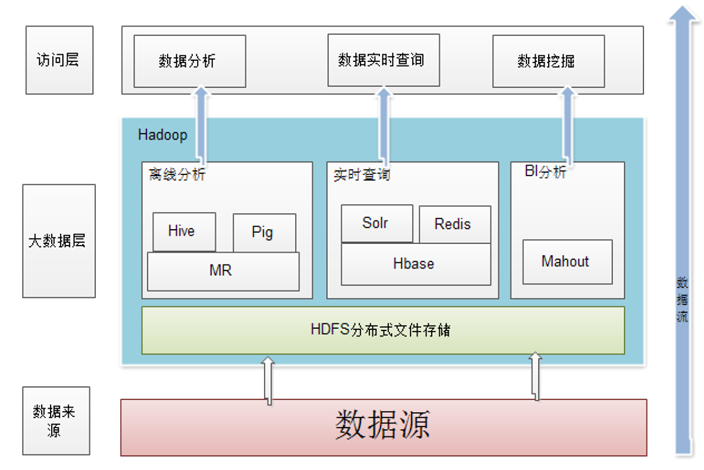

# Hadoop

## 概述

- Apache 软件基金会旗下的一个开源分布式计算平台，为用户提供了系统底层细节透明的分布式基础架构

- Java 语言开发

- 核心是分布式文件系统 HDFS（Hadoop Distributed File System）和 MapReduce

- Hadoop 是一个能够对大量数据进行分布式处理的软件框架，并且是以一种可靠、高效、可伸缩的方式进行处理的，它具有以下几个方面的特性：
  - 高可靠性
  - 高效性
  - 高扩展性
  - 高容错性
  - 成本低
  - 运行在 linux 平台上
  - 支持多种编程语言

| 组件        | 功能                                         |
|-----------|--------------------------------------------|
| HDFS      | 分布式文件系统                                    |
| MapReduce | 分布式并行编程模型                                  |
| YARN      | 资源管理和调度器                                   |
| Tez       | 运行在YARN之上的下一代查询框架                          |
| Hive      | Hadoop上的数据仓库                               |
| HBase     | Hadoop上的非关系型分布式数据库                         |
| Pig       | 一个基于Hadoop的大规模  分析平台，提供类似SQL的查询语言Pig Latin |
| Sqoop     | 用于在在Hadoop与传统数据库之间进行数据传递。类似阿里datax         |
| Ooize     | Hadoop上的工作流管理器                             |
| Zookeeper | 提供分布式协调一致性服务                               |
| Storm     | 流计算框架                                      |
| Flume     | 一个高可用的、高可靠的分布式的海量日志采集、聚合和传输的系统             |
| Ambari    | Hadoop快速部署工具，支持Apache Hadoop集群的供应、管理和监控    |
| Kafka     | 一种高吞吐量的分布式发布订阅系统，可以处理消费者规模的网站中所有动作流数据      |
| Spark     | 类似于MapReduce的通用并行框架                        |

## 安装与使用

## 集群的部署与使用
