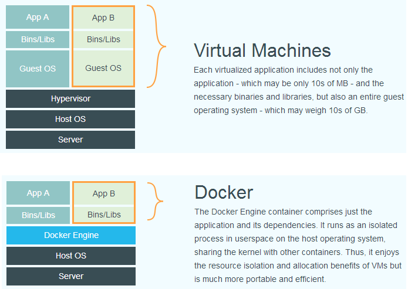

## 综述

Docker 使用 Go 语言开发，基于 Linux 内核的 cgroup，namespace 以及 AUFS 类的 Union FS 等技术，对进程进行封装隔离，属于操作系统层面的虚拟化技术
由于隔离的进程独立于宿主和其他的隔离的进程，因此也称其为容器

- 容器与虚拟机

  传统虚拟机技术是虚拟出一套硬件后，在其上运行一个完整操作系统，在该系统上再运行所需应用进程

  而容器内的应用进程直接运行于宿主的内核，容器内没有自己的内核，而且也没有进行硬件虚拟。因此容器要比传统虚拟机更为轻便

  | 特性       | 容器               | 虚拟机     |
  | ---------- | ------------------ | ---------- |
  | 启动       | 秒级               | 分钟级     |
  | 硬盘使用   | 一般为MB           | 一般为GB   |
  | 性能       | 接近原生           | 弱于       |
  | 系统支持量 | 单机支持上千个容器 | 一般几十个 |

  

- 为什么要使用 docker
  - 更高效的利用系统资源

    容器不需要进行硬件虚拟以及运行完整操作系统等额外开销

  - 更快速的启动时间

    容器运行与宿主内核，无需启动完整的操作系统

  - 一致的运行环境

    开发过程中一个常见的问题是环境一致性问题。由于开发环境、测试环境、生产环境不一致，导致有些 bug 并未在开发过程中被发现。而 Docker 的镜像提供了除内核外完整的运行时环境，确保了应用运行环境一致性，从而不会再出现 「这段代码在我机器上没问题啊」 这类问题

  - 持续交付与部署

  - 更轻松的迁移

    环境一致性

  - 更轻松的维护和扩展

- 基本概念
  - 镜像image

    镜像是一个特殊的文件系统，除了提供容器运行时所需的程序、库、资源、配置等文件外，还包含了一些为运行时准备的一些配置参数（如匿名卷、环境变量、用户等）。镜像不包含任何动态数据，其内容在构建之后也不会被改变

    使用分层存储。镜像构建时，会一层层构建，前一层是后一层的基础。因此，在构建镜像的时候，需要额外小心，每一层尽量只包含该层需要添加的东西，任何额外的东西应该在该层构建结束前清理掉。分层存储的特征还使得镜像的复用、定制变的更为容易。甚至可以用之前构建好的镜像作为基础层，然后进一步添加新的层，以定制自己所需的内容，构建新的镜像。

  - 容器caontainer

    容器与镜像的关系就像是Java语言中类与实例。

    镜像是静态的定义，容器是镜像运行时的实体。

    容器的实质是进程， 但与直接在宿主执行的进程不同，容器进程运行于属于 自己独立的命名空间。因此容器可以容有自己的root文件系统、自己的网络配置、自己的 进程空间、甚至自己的用户id空间

    容器也是分层存储。每一个容器运行时以镜像为基础，建立一个当前容器的存储层。当容器消亡时，容器存储层也会随之消亡

    使用数据卷或绑定宿主目录写的数据不会随容器消亡而丢失
    
  - 仓库repository

    镜像构建完成后，可以很容易的在当前宿主机上运行，但是，如果需要在其它服务器上使用这个镜像，我们就需要一个集中的存储、分发镜像的服务，Docker Registry 就是这样的服务。

    一个 Docker Registry 中可以包含多个仓库（Repository）；每个仓库可以包含多个标签（Tag）；每个标签对应一个镜像。

- 安装

## docker运用

- 获取镜像

    `docker pull [选项] [Docker Registry 地址[:端口号]/]仓库名[:标签]`

    镜像名称：默认DockerHUB，格式一般是 <域名/IP>[:端口号]
    仓库名：仓库名是两段式名称，即 <用户名>/<软件名>。对于 Docker Hub，如果不给出用户名，则默认为 library，也就是官方镜像

    可以通过`docker iamge ls`或者`docker iamges`**查看镜像**

        列表包含了 仓库名、标签、镜像 ID、创建时间 以及 所占用的空间。

    `docker system df`可以便捷的**查看镜像、容器、数据卷所占用的空间**

    - 虚悬镜像<none>
      - docker pull 旧的已不存在的
      - docker build 新旧镜像同名
      - 显示这类镜像：`docker image ls -f dangling=true`
      - 删除这类镜像：`docker image prune`

    docker ls -afq --format 不同的参数，列出不同的结果

- 定制镜像
  - docker run
  - dockerfile
    - FROM 
    - RUN
    - docker build进行构建
      - git仓库 docker build https://github.com/twang2218/gitlab-ce-zh.git
      - tar 压缩包构建 docker build http://server/context.tar.gz
      - Dockerfile 进行构建 docker build - < Dockerfile
      - docker build -t="xxx:xx" .

- 启动镜像
  - 新建并启动 docker run iamge
    - 检查本地是否存在指定的镜像，不存在就从公有仓库下载
    - 利用镜像创建并启动一个容器
    - 分配一个文件系统，并在只读的镜像层外面挂载一层可读写层
    - 从地址池配一个ip地址给容器
    - 执行用户制定的程序
    - 执行完毕容器被终止
    
  - 启动已终止容器 docker start container
    可以通过`docker ps` **查看活动状态容器**
    或者使用`docker container ls -a`**查看所有容器**

- 删除操作

## 相关文档

https://github.com/yeasy/docker_practice
https://legacy.gitbook.com/book/yeasy/docker_practice/details
