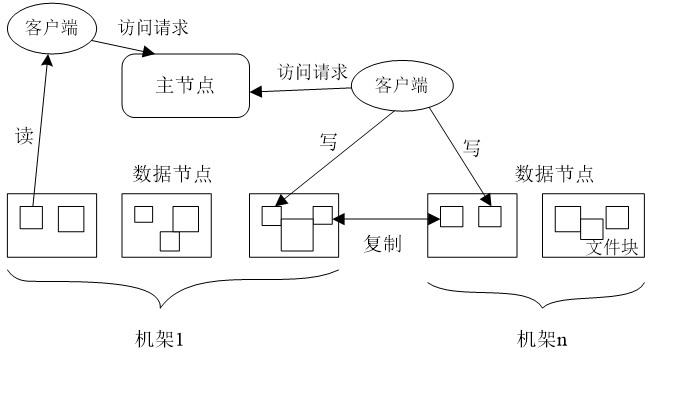
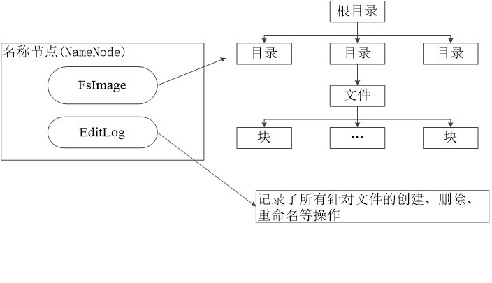

## 概述

- 分布式文件系统的结构
  分布式文件系统把文件分布存储在多个计算机节点上，成千上万的计算机节点构成计算机集群

  节点 ： 主节点 (MasterNode 或者名称节点 NameNode) 与 从节点 (SlaveNode 或者 数据节点 DataNode)

  

  HDFS 要实现的目标：

      - 兼容廉价的硬件设备
      - 流数据读写
      - 大数据集
      - 简单的文件模型
      - 强大的跨平台兼容性

  局限性：

        - 不适合低延迟数据访问
        - 无法高效存储大量小文件
        - 不支持多用户写入及任意修改文件

- 块

  HDFS 默认一个块 64M，一个文件被分成多个块，以块作为存储单位
  与普通文件系统的块相比，远远大于，可以最小化寻址开销
  HDFS 采用抽象的块概念可以带来以下几个明显的好处：

        - 支持大规模文件存储

            文件以块作为单位存储，一个大规模文件可以被分拆为若干个文件块，不同的文件块可以被分发到不同的节点上。
            因此，一个文件的大小不会受到单个节点的存储容量的限制，可以远远大于网络中任意节点的存储容量

        - 简化系统设计

            因为文件块大小是固定的，这样就很容易计算出一个节点可以存储多少文件块
            其次，方便了元数据的管理，元数据不需要和文件块一起存储，可以由其他系统负责管理元数据

        - 适合数据备份

            每个文件块可以冗余存储在多个节点上，大大提高了系统的容错性和可用性

- 主要组件： NameNode 与 DataNode

  | NameNode                            | DataNode             |
  | ----------------------------------- | -------------------- |
  | 存储元数据                          | 存储文件类容         |
  | 元数据保存在内存中                  | 文件内容保存在磁盘中 |
  | 保存文件、block、DataNode之间的映射 |                      |

  - Name Node
    - 负责管理分布式文件系统的命名空间(NameSpace)，保存了两个核心的数据结构，即FsImage和EditLog
      - FsImage 用于维护文件系统树以及文件树中的所有文件和文件夹的元数据
      - EditLog 记录所有针对文件的创建、删除、重命名等操作
    - 名称节点记录了每个文件中各个块所在额数据节点的位置信息
    

    - **Fsimage**
    - **EditLog**
    - **secondaryNameNode**

  - DataNode
    - 
## 存储原理

## 编程实战
