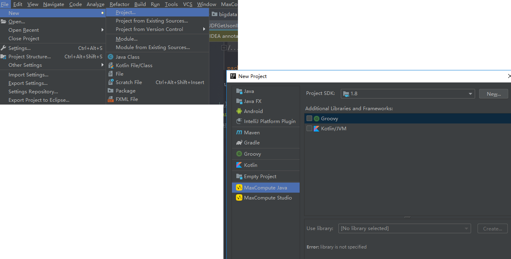
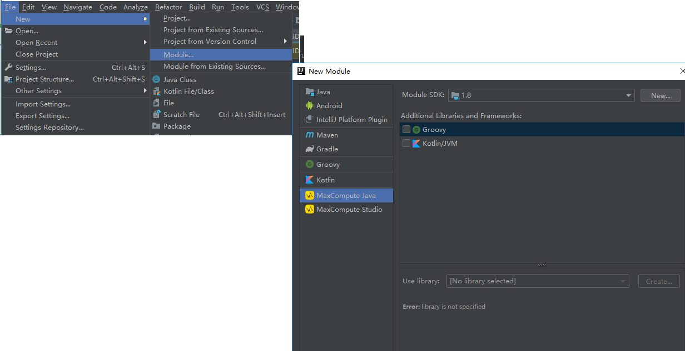

## 编写 udf

- idea 安装 MaxCompute Studio 插件
  - 本地安装
  - 插件库安装
- 创建 project
  new -> project -> MaxCompute Studio
  
- 创建 module
  new -> Module -> Maxcompute Java
  
- 编写 Java 类
  src/main/java 包上 new -> Maxcompute Java
  - 类继承 UDF
  - 主要方法 evaluate()

## 上传 udf

- docker 中运行：

  所以需要一个 docker 镜像，镜像中有 maven 环境，有 odps 客户端可以上传 udf

  - maven 打包 udf 为可执行 jar

    `mvn clean package`

  - 然后使用 odps 客户端推送 jar 到 odps 上

    需要有 odps 客户端，安装：

    ```
    centos : sudo yum -y install odpscmd
    Ubuntu : sudo apt-get -y install odpscmd
    修改配置 ~/.odpscmd/odps_config.ini
        project_name=<project_name>
        access_id=<accessid>
        access_key=<accesskey>
        end_point=http://service.odps.aliyun.com/api
        tunnel_endpoint=http://dt.odps.aliyun.com
        log_view_host=http://logview.odps.aliyun.com
        https_check=true
    ```

    然后使用 odps 客户端推送 jar
    odps 连接需要

    ```
    odpscmd
    add jar UDFGetJsonID.jar
    ```

  - 创建函数

    `CREATE FUNCTION UDFGetJsonID AS com.qunhe.bigdata.UDFGetJsonID USING UDFGetJsonID.jar`

- 配置 gitlabci (配置 .gitlab-ci.yml)

  ```
    image: registry.xxx.com/datax/udf_upload

    stages:
    - build
    - upload

    before_script:
    - source /etc/profile
    - MOUDLE_NAME=$(ls -R | grep '.*/src/' | awk '{FS="/"}  {print $2}' | sed -n '1,2p')
    - UDF_LIST_STR=$(ls -R | grep '.*\.java')
    - UDF_LIST_STR=${UDF_LIST_STR//.java/}

    cache:
    paths:
        - ./*/target/*.jar

    build:
    stage: build
    tags:
        - kube-runner
    script:
        - cd $MOUDLE_NAME
        - mvn clean package
    only:
        - master

    upload:
    stage: upload
    tags:
        - kube-runner
    script:
        - JAR_NAME=$(ls -R | grep '.*\.jar')
        - odpscmd -e "add jar $MOUDLE_NAME/target/$JAR_NAME -f"
        - OLD_IFS="$IFS"
        - IFS=" "
        - UDF_LIST=($UDF_LIST_STR)
        - IFS="$OLD_IFS"
        - for var in ${UDF_LIST[@]}; do odpscmd -e "DROP FUNCTION $var" ; done
        - for var in ${UDF_LIST[@]}; do odpscmd -e "CREATE FUNCTION $var AS $var USING $JAR_NAME" ; done
    only:
        - master

  ```

## 遇到的问题

- udf 编写
- docker 镜像建立
  - push 公共仓库直接 push；私有仓库需要先标记名称
  - dockerfile 与 RUN commit
- udf 上传
  - 配置文件中非 script 作用域中，不能使用 shell 变量
  - 文件与函数会重复，所以文件需要覆盖，而函数没有覆盖选项，所以将函数先行删除在注册函数

## 相关文档

- [JAVA UDF 开发](https://help.aliyun.com/document_detail/27811.html?spm=a2c4g.11186623.6.569.21e82343E8880r)
- [odps 资源操作](https://help.aliyun.com/document_detail/27831.html)
- [odps 函数操作](https://help.aliyun.com/document_detail/27832.html)
- [使用.gitlab-ci.yml 配置作业](https://gitlab.qunhequnhe.com/help/ci/yaml/README)
