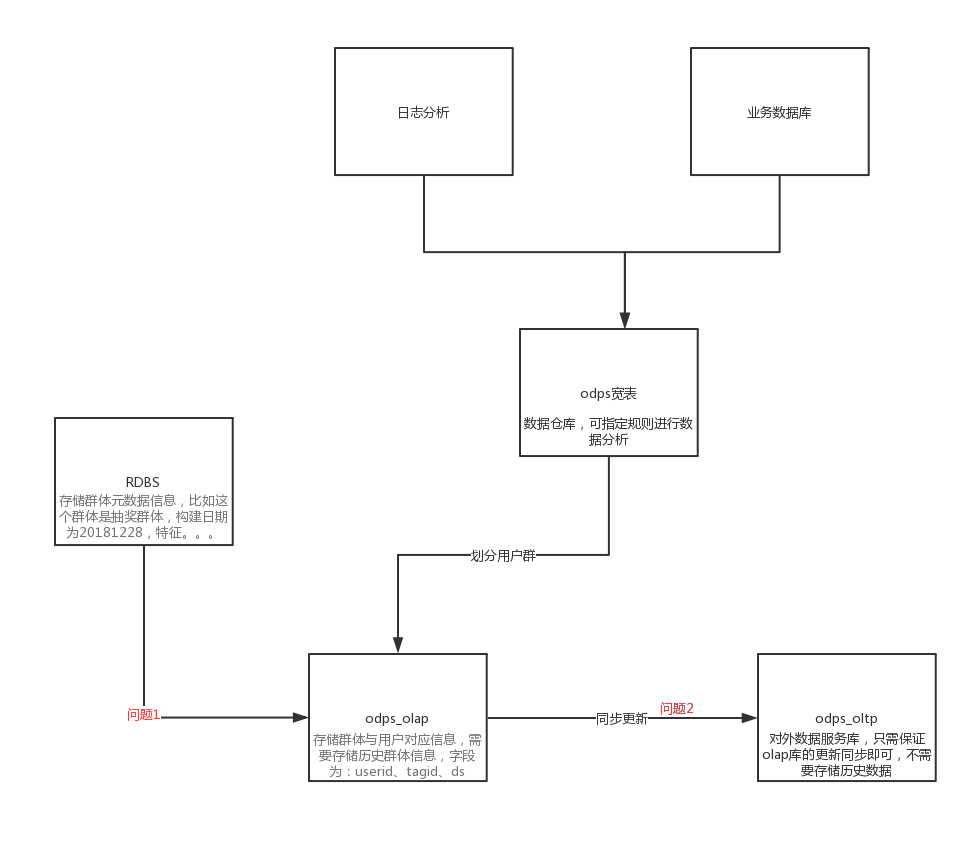

# 更新过程中的查询

## 项目背景

我们需要对每天的活跃用户进行划分群体(外部群体数据导入，ETL按照一定规则进行划分)，并提供其他需求方(数据分析部、运营部、算法部等等)提供数据服务，

    ```
    数据化运营
    用户画像    全球76亿人口中约2/3拥有手机，半数为 智能型设备  服务细分 千人千面
    日志分析  埋点日志/日志采集/日志分析
    ```

元数据是 odps(阿里云提供的大数据计算平台) 宽表，以及外部数据导入



- 底层架构初始问题：
  - 存储使用什么？
    - MYSQL，目前该表大概有2亿条数据，之后在人群来源更多了之后，数据增长会更快，mysql应该是吃不消的。

    - ADS，继续使用ADS，这个是可以的，目前的解决方案也是在saas那个ads的库中。因为只同步一天的人群即可，所以不需要担心数据量的增长，

        但是同步到ADS中，稳定性是受ADS的影响的，目前来看ADS的稳定性并不是很能够得到保障，还有就是单独开一个ADS的库，成本也稍微高一些。

    - ES：使用ES直接存储人群关系的话，存储为一个index，两个fileld，无法按tagId字段删除。
  - 存储数据格式是什么样的？
   
    我们的业务需求是提供 /user/tags 这个接口的稳定对外服务，qps达到400-500

    可以直接存储 userid，tagid的对应关系，也可以直接存储userid，tagidList的对应关系。前者是直接存储人群。

    后者是需要在olap计算好计算好的用户和分群集合的对应关系，然后再进行存储。（这种应该是不提倡的，因为olap的稳定性和速度都没有办法保证，如果这么做的话和直接将查询落在olap上没有区别）

  - 在对外接口的数据存储定下来了后，olap中的分群变化后，如何去做数据同步到对外接口库？
  
    ```
        为什么需要数据的同步？

        人群的生成和变动最终都会落在olap库中，查询的接口使用的存储中的数据并不是实时更新的，所以需要从olap库中去同步这部分的更新数据。
        olap中的数据每天分为初始化和变动两个部分

        初始化：odps→ads用户宽表，规则动态分群更新，静态分群+自定义分群拷贝t-1，同步etl人群+圈选人群的生成的规则人群。
        变动：创建规则分群+同步etl人群+同步圈选规则人群
        做数据同步，可以以人群为粒度，每一个人群拆分成一个任务，交给EOS去执行同步，需要考虑的是上游只需要将任务拆分丢弃给EOS系统即可，失败重试，幂等性由EOS系统的任务保证。
    ```

- 问题1： 用户群新增更新操作时,此时如何保证查询到有效的数据
- 问题2： 数据同步更新时，如何保证查询到有效的数据
  - 分群的存储和删除? 比如很快的新建分群，然后删除分群，同步是分布式任务，很可能先到达删除任务，在到达新建任务，此时如何处理

## 数据化运营

> DAU(Daily Active User)日活跃用户数量。常用于反映网站、互联网应用或网络游戏的运营情况。DAU 通常统计一日（统计日）之内，登录或使用了某个产品的用户数（去除重复登录的用户），这与流量统计工具里的访客（UV）概念相似。
>
> 通常 DAU 会结合 MAU（月活跃用户数量）一起使用，这两个指标一般用来衡量服务的用户粘性以及服务的衰退周期。 [1] MAU、DAU 分别从宏观和微观的角度对服务的用户粘性做了权衡，也可以这么说，MAU 更像战略层面的表征，DAU 更像战术层面的表征。通过这些宏观和细微的趋势变化，可以对营销及推广提供一些数据支持或者帮助。

有一个近来不景气的电商平台，平台日活从年初 50 万一路下跌，到了现在哈，剩下 40 万底裤，1.老板绞尽脑汁去哄着投资人；2.老板勒紧裤带过日子(员工就更不好过了)

这个时候老板那可以做什么呢？BD、市场、运营建言献策：

- “谈几家合作平台，互换资源搞些流量？”
- “投几个内容 KOL(关键意见领袖，如大 V)，或者投点广告主？”
- “加做几场促销吧，配合 Push 能涨点日活”

- 捞回老客 流失老客召回一定比拉新成本更低，更精准，流量质量更好。

方法：

- 推送方式 ： 网站私信/短信/邮件....

  ```
  在我们的日常中，这种营销很常见，而且现在的大平台会做一些精准话的营销，比如构建用户画像，分群，针对群体特点进行推送广告或者优惠信息！
  ```

- 活动：

  - 促销优惠
  - 赠送优惠券
  - 商品领取 回归免费领礼品 -- 事实证明 这一事件很容易拉回老客户

  - 社交裂变

- 数据

  - 数据支撑
    - 群体划分
    - 群体特征模型
  - 数据反馈

        - 响应数据 漏斗分析
          假设我们在今日头条投放了一则广告，一段时间内，1000 人点击了广告，200 人点击后进行了注册，50 人注册后根据提示下载了 APP，最后只有 10 人在 APP 完成了消费转化。

          在这里，从 1000 到 10，就是一个简单的漏斗。任何一个活动，从触达后用户的首个特定动作发生到最终的转化，就是一个漏斗。漏斗展示了一次活动的直接成效，并将成效分解到各个步骤，为结果提供每个层次的归因

        - 裂变数据
          饿了么式的红包分享、拼多多式的助力砍价，还是每日优鲜的 0 元吃水果、携程的助力抢车票，亦或是近期朋友圈现象级的网易荣格心理测试、连咖啡的“我的咖啡店”，这些教科书级的活动或玩法，不论转化导向或传播导向，都是围绕“社交”这个价值点展开的
        - 价值追踪
          - 对于新加入的用户，又可以继续追踪他们的日常行为进行进一步分析，为后续分分析提供支持
          - 知乎

            | 用户类型       | 用户行为               | 价值                         |
            | -------------- | ---------------------- | ---------------------------- |
            | 一般内容消费者 | 没事刷知乎，只看不说话 | 消费主体与流量主题，人多     |
            | 传播互动型用户 | 点赞/评论/分享/转发    | 碎片内容生产，传播           |
            | 知识付费者     | 购买会员或live私家课   | 核心内容消费者，重要收入     |
            | 一般内容生产者 | 80%内容生产            | 内容生态的基石，大v的绿叶    |
            | 大V            | 头部内容的生产         | 20%的内容带来80%的流量与收入 |


        - 成本评估
          - 有效的活动可以继续
